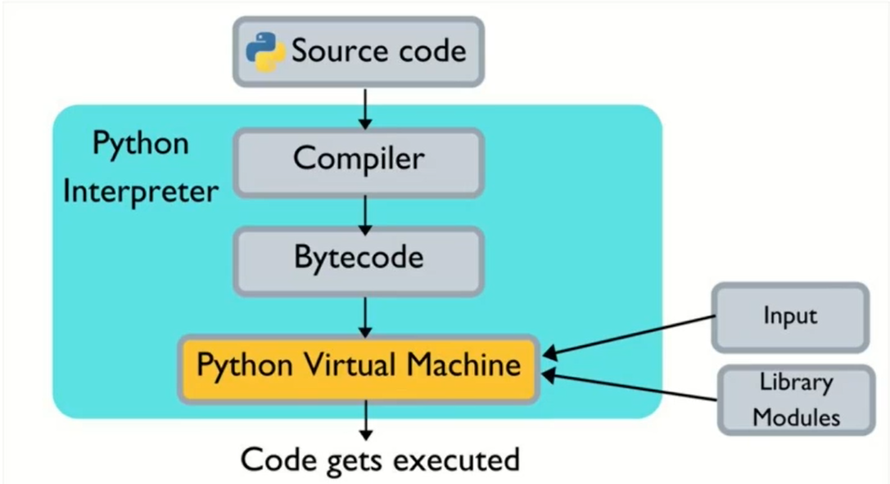

## [Programação Concorrente e Assíncrona em Python](https://www.udemy.com/course/programacao-concorrente-e-assincrona-com-python/)

# Conceitos

O que ocorre ao executar um código Python?

> Source Code(Código Fonte) é compilado, o interpretador Python transforma em Bytecode e a máquina virtual Python vai executar, na máquina virtual Python o processo será criado e a Thread será executada

