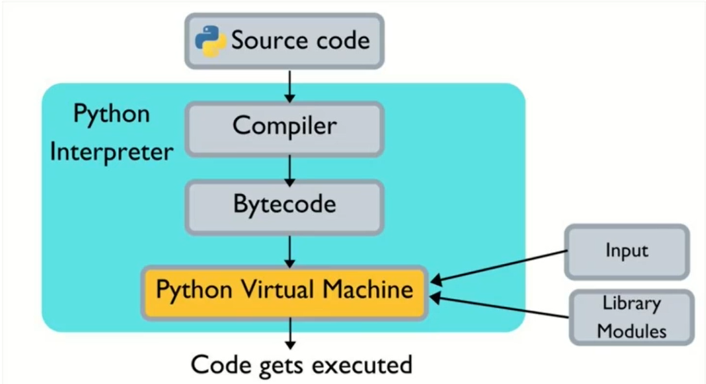
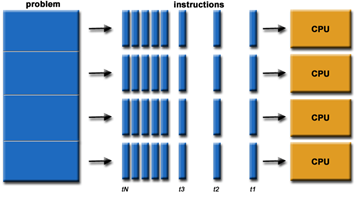
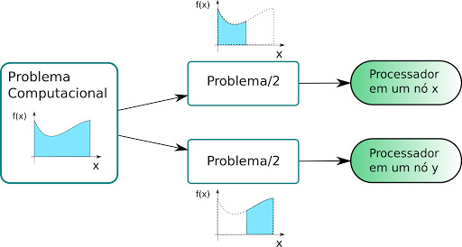

## [Programação Concorrente e Assíncrona em Python](https://www.udemy.com/course/programacao-concorrente-e-assincrona-com-python/)

# Conceitos

O que ocorre ao executar um código Python?




> Source Code(Código Fonte) é compilado, o interpretador Python transforma em Bytecode e a máquina virtual Python vai executar, na máquina virtual Python o processo sserá criado e a Thread será executada

Em Ciência da Computação, Concorrência é a execução de múltiplas instruções sequenciais ao mesmo tempo, sendo os dois tipos principais: 

1. Programação Paralela

2. Programação Assíncrona

   

Devemos nos atentar então para alguns pontos fundamentais como:

   1. Ordem de Execução 

   2. Recursos Compartilhados

Quanto mais recursos são compartilhados entre execuções concorrentes, mais coordenação entre as execuções será necessaria para garantir que o resultado final esteja correto, dificultando o processo, ou seja, a execução deve compartilhar o mínimo de recursos possíveis entre as instruções 

# Tipos de Concorrência

<center>
<h2> Programação Paralela </h2>

</center>
A programação paralela se baseia em pegar um problema computacional e dividí-l0 em pequenas sub-tarefas, e executá-las em múltiplos cores de forma simultânea, cada parte é igualmente constítuida por uma série de instruções sequenciais, mas que no conjunto podem ser executadas.

<center>

</center>

## Introdução as Threads
Uma thread é um caminho de execução dentro de um processo. Um processo pode conter vários threads.
##### Por que Multithreading?
Uma thread também é conhecido como processo leve. A ideia é alcançar o paralelismo dividindo um processo em várias threads. Por exemplo, em um navegador, várias guias podem ter encadeamentos diferentes. O MS Word usa várias threads: uma thread para formatar o texto, outraa thread para processar entradas, etc. Mais vantagens do multithreading são discutidas abaixo
#### Processos vs Threads
A principal diferença é que os encadeamentos dentro do mesmo processo são executados em um espaço de memória compartilhado, enquanto os processos são executados em espaços de memória separados.
Os threads não são independentes uns dos outros como os processos são, e como resultado, os threads compartilham com outros threads sua seção de código, seção de dados e recursos do sistema operacional (como arquivos abertos e sinais). Mas, como o processo, uma thread tem seu próprio contador de programa (PC), conjunto de registradores e espaço de pilha.

##### Vantagens do Thread sobre o Processo

1. Capacidade de resposta: Se o processo for dividido em vários threads, se um thread concluir sua execução, sua saída poderá ser retornada imediatamente.

2. Troca de contexto mais rápida: O tempo de troca de contexto entre as threads é menor em comparação com a troca de contexto do processo. A comutação de contexto de processo requer mais sobrecarga da CPU.

3. Utilização eficaz do sistema multiprocessador: Se tivermos vários threads em um único processo, podemos agendar vários threads em vários processadores. Isso tornará a execução do processo mais rápida.

4. Compartilhamento de recursos: Recursos como código, dados e arquivos podem ser compartilhados entre todas as threads de um processo.
Nota: pilha e registradores não podem ser compartilhados entre as threads. Cada thread tem sua própria pilha e registradores.

5. Comunicação: A comunicação entre vários encadeamentos é mais fácil, pois os encadeamentos compartilham um espaço de endereço comum. enquanto em processo temos que seguir alguma técnica de comunicação específica para comunicação entre dois processos.

6. Taxa de transferência aprimorada do sistema: Se um processo for dividido em vários segmentos e cada função de segmento for considerada como um trabalho, o número de trabalhos concluídos por unidade de tempo será aumentado, aumentando assim a taxa de transferência do sistema.

##### Tipos de Threads
Existem dois tipos de threads:
1. Thread de nível de usuário 
2. Thread de nível de kernel


[Consulte - Difference between User Level thread and Kernel Level thread](https://www.geeksforgeeks.org/difference-between-user-level-thread-and-kernel-level-thread/)

##### [Multithreading Python](https://www.geeksforgeeks.org/multithreading-python-set-1/)
``` Python

# Python program to illustrate the concept
# of threading
# importing the threading module
import threading
 
 
def print_cube(num):
    # function to print cube of given num
    print("Cube: {}" .format(num * num * num))
 
 
def print_square(num):
    # function to print square of given num
    print("Square: {}" .format(num * num))
 
 
if __name__ =="__main__":
    # creating thread
    t1 = threading.Thread(target=print_square, args=(10,))
    t2 = threading.Thread(target=print_cube, args=(10,))
 
    # starting thread 1
    t1.start()
    # starting thread 2
    t2.start()
 
    # wait until thread 1 is completely executed
    t1.join()
    # wait until thread 2 is completely executed
    t2.join()
 
    # both threads completely executed
    print("Done!")
```

````
Square: 100
Cube: 1000
Done!
````


##### Questões
1. https://www.geeksforgeeks.org/gate-gate-cs-2011-question-16/
2. https://www.geeksforgeeks.org/gate-gate-cs-2007-question-17/
3. https://www.geeksforgeeks.org/gate-gate-cs-2014-set-1-question-30/


#### Referências
##### Threads
1. [Multithreading in C](https://www.geeksforgeeks.org/multithreading-c-2/)
2. [Thread in operanting system](https://www.geeksforgeeks.org/thread-in-operating-system/)